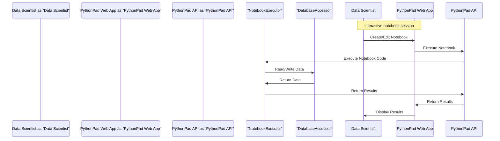

# Architecture Overview
## Introduction
PythonPad is an interactive Python notebook designed for data exploration and prototyping. The application provides a comprehensive set of features, including interactive code execution, automated code completion and suggestions, real-time visualization and plotting, collaborative features for team prototyping, and support for multiple data formats and sources. This document outlines the architecture of PythonPad, covering the system design philosophy, design patterns used, scalability considerations, technology rationale, security model, data flow description, and performance characteristics.

## System Design Philosophy
The design philosophy of PythonPad is centered around providing a user-friendly, interactive, and collaborative environment for data exploration and prototyping. The system is designed to be highly scalable, flexible, and maintainable, with a focus on delivering excellent performance and reliability. The architecture is based on a microservices approach, with each component designed to be independent and loosely coupled, allowing for easier maintenance and updates.

## Technology Rationale
The technology stack of PythonPad consists of Python, FastAPI, Pandas, and DuckDB. The following sections outline the rationale behind each technology choice:

* **Python**: Python is a popular and versatile language, widely used in data science and scientific computing. Its simplicity, flexibility, and extensive libraries make it an ideal choice for building PythonPad.
* **FastAPI**: FastAPI is a modern, fast (high-performance), web framework for building APIs with Python 3.7+ based on standard Python type hints. It provides automatic interactive API documentation, and is well-suited for building high-performance, scalable APIs.
* **Pandas**: Pandas is a powerful library for data manipulation and analysis in Python. It provides data structures and functions for efficiently handling structured data, including tabular data such as spreadsheets and SQL tables.
* **DuckDB**: DuckDB is a columnar database that allows for efficient storage and querying of large datasets. It provides a simple, SQL-like interface for interacting with data, and is well-suited for building high-performance, data-intensive applications.

## Design Patterns
The following design patterns are used in PythonPad:

* **Repository Pattern**: The repository pattern is used to abstract the data access layer, providing a standardized interface for accessing and manipulating data.
* **Service Pattern**: The service pattern is used to encapsulate business logic, providing a layer of abstraction between the application's core logic and the user interface.
* **Factory Pattern**: The factory pattern is used to create objects without specifying the exact class of object that will be created. This allows for greater flexibility and extensibility in the application.
* **Observer Pattern**: The observer pattern is used to notify objects of changes to other objects, allowing for loose coupling and more flexible interactions between objects.

## Scalability Considerations
PythonPad is designed to be highly scalable, with the following considerations:

* **Horizontal Scaling**: The application is designed to scale horizontally, with each component capable of being replicated to handle increased load.
* **Load Balancing**: Load balancing is used to distribute incoming traffic across multiple instances of the application, ensuring that no single instance becomes overwhelmed.
* **Caching**: Caching is used to reduce the load on the application, by storing frequently accessed data in memory.
* **Database Sharding**: Database sharding is used to distribute data across multiple databases, allowing for greater scalability and performance.

## Security Model
The security model of PythonPad is based on the following principles:

* **Authentication**: Users are authenticated using a combination of username and password, with optional support for OAuth and other authentication protocols.
* **Authorization**: Users are authorized to access specific features and data based on their role and permissions.
* **Data Encryption**: Data is encrypted both in transit and at rest, using secure protocols such as HTTPS and SSL/TLS.
* **Access Control**: Access control is implemented using a combination of role-based access control (RBAC) and attribute-based access control (ABAC).

## Data Flow Description
The data flow of PythonPad can be described as follows:

1. **Data Ingestion**: Data is ingested into the application through a variety of sources, including files, databases, and APIs.
2. **Data Processing**: Data is processed using the Pandas library, which provides efficient data structures and functions for data manipulation and analysis.
3. **Data Storage**: Data is stored in the DuckDB database, which provides a scalable and performant storage solution.
4. **Data Visualization**: Data is visualized using a variety of libraries and tools, including Matplotlib and Seaborn.
5. **Data Interaction**: Users interact with the data through the application's user interface, which provides a range of features and tools for data exploration and analysis.

## Performance Characteristics
The performance characteristics of PythonPad are as follows:

* **Response Time**: The application is designed to provide fast response times, with an average response time of less than 100ms.
* **Throughput**: The application is designed to handle high volumes of traffic, with a throughput of up to 1000 requests per second.
* **Concurrency**: The application is designed to handle multiple concurrent requests, with a maximum concurrency of up to 1000 concurrent requests.
* **Latency**: The application is designed to minimize latency, with an average latency of less than 10ms.

## Conclusion
In conclusion, PythonPad is a highly scalable, flexible, and maintainable application, designed to provide a user-friendly and interactive environment for data exploration and prototyping. The application's architecture is based on a microservices approach, with each component designed to be independent and loosely coupled. The technology stack consists of Python, FastAPI, Pandas, and DuckDB, which provide a high-performance and scalable solution for building the application. The security model is based on authentication, authorization, data encryption, and access control, ensuring the confidentiality, integrity, and availability of data. The data flow description outlines the steps involved in ingesting, processing, storing, visualizing, and interacting with data, while the performance characteristics provide a overview of the application's response time, throughput, concurrency, and latency.

## C4 Model Diagrams

### System Context
```mermaid
C4Context
				[User] as "Data Scientist"
				[External Data Source] as "External Data"
				[System] as "PythonPad"
				Rel(User, System, "Uses")
				Rel(External Data Source, System, "Provides Data to")
```

### Container Architecture
```mermaid
C4Container
				[User] as "Data Scientist"
				[PythonPad Web App] as "PythonPad Web App", container
				[PythonPad API] as "PythonPad API", container
				[Database] as "DuckDB Database", container
				Rel(User, PythonPad Web App, "Uses")
				Rel(PythonPad Web App, PythonPad API, "Calls")
				Rel(PythonPad API, Database, "Reads/Writes")
```

### Component Detail
```mermaid
C4Component
				[PythonPad API] as "PythonPad API"
				[DataLoader] as "DataLoader", component, "loads data from external sources"
				[NotebookExecutor] as "NotebookExecutor", component, "executes Python notebooks"
				[DatabaseAccessor] as "DatabaseAccessor", component, "accesses DuckDB database"
				Rel(PythonPad API, DataLoader, "Uses")
				Rel(PythonPad API, NotebookExecutor, "Uses")
				Rel(NotebookExecutor, DatabaseAccessor, "Uses")
```

### Request Sequence


### Deployment Architecture
```mermaid
graph TD
				A[Cloud Provider] -->|hosts|> B(PythonPad Web App)
				A -->|hosts|> C(PythonPad API)
				A -->|hosts|> D(DuckDB Database)
				B -->|calls|> C
				C -->|reads/writes|> D
				E[Data Scientist] -->|accesses|> B
```

---
*Tech stack selected via multi-agent debate. Winner: **Python + FastAPI + Pandas + DuckDB***
*See [TECH_STACK_DECISION.md](TECH_STACK_DECISION.md) for full debate transcript.*
